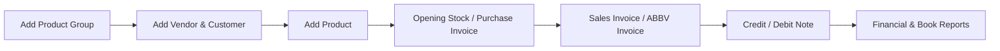

# IMS WebPOS Automation Framework (Playwright + Pytest)

The framework automates and validates the entire operational business flow of IMS Software — ranging from user authentication, master data configuration (Products, Groups, Categories, Customers, Vendors), end-to-end transactional workflows (Purchase, Sales, Abbreviated Invoices, Debit/Credit Notes), to financial reports and books verification.

## Key Features

- **Page Object Model (POM):** Clean separation between page locators/interactions (`Pages/`) and test assertions/scenarios (`Tests/`).
- **Data-Driven & Dynamic State Management:** Automatically captures newly generated entity records (e.g. Products, Vendors, Customers, Groups) into `CSV/` files with FIFO management to feed downstream transaction tests.
- **Automated Full-Page Screenshots:** Custom `pytest_runtest_makereport` hook captures full-page screenshots upon test execution and attaches them directly to HTML reports.
- **Browser Print Handling:** Configured with `--kiosk-printing` and `--disable-print-preview` args to seamlessly bypass native browser print dialogs during invoice printing flows.
- **Session Conflict Resolution:** Built-in auto-handling for concurrent login popups (detects and terminates existing active sessions).
- **Flexible CLI Configuration:** Supports passing target environment URL, username, and password directly via custom Pytest CLI arguments.

---

## Project Architecture

```plaintext
IMS-Automation-Playwright/
├── conftest.py                   # Pytest fixtures (browser, page, config) & screenshot reporting hooks
├── ReadMe.md                     # Project documentation
├── .gitignore                    # Git ignore configurations
│
├── CSV/                          # Runtime & test data files (State chaining between tests)
│   ├── customers.csv             # Generated customer test records
│   ├── product_details.csv       # Generated product records (Item Code, HS Code, Price, VAT)
│   ├── product_groups.csv        # Generated product group records
│   └── vendors.csv               # Generated vendor test records
│
├── Pages/                        # Page Object Model (POM) Layer
│   ├── Login.py                  # Login page interactions & session handler
│   ├── Masters/                  # Master setup pages
│   │   ├── add_category.py
│   │   ├── add_customer.py
│   │   ├── add_product.py
│   │   ├── add_product_group.py
│   │   ├── add_vendor.py
│   │   └── bulk_price_change.py
│   ├── Transactions/             # Transactional workflow pages
│   │   ├── Abbv_invoice.py       # Abbreviated / POS invoice
│   │   ├── Opening_stock.py      # Opening stock adjustments
│   │   ├── Purchase_invoice.py   # Purchase entry & invoice
│   │   ├── Sales_invoice.py      # Sales billing & invoice
│   │   ├── credit_note.py        # Sales return (Credit Note)
│   │   └── debit_note.py         # Purchase return (Debit Note)
│   └── Report/                   # Reports & financial register pages
│       ├── Credit_Note_Report.py
│       ├── Debit_Note_Report.py
│       ├── Purchase_Book_Report.py
│       └── Sales_Book_Report.py
│
├── Tests/                        # Test Suites & Scenarios
│   ├── Test_login.py             # Login verification test
│   ├── Masters/                  # Master data test cases
│   │   ├── test_01_add_product_group.py
│   │   ├── test_02_add_customer.py
│   │   ├── test_02_add_vendors.py
│   │   ├── test_03_add_product.py
│   │   ├── test_add_category.py
│   │   └── test_bulk_price_change.py
│   ├── Transactions/             # Transaction test cases
│   │   ├── test_1_opening_stock.py
│   │   ├── test_1_purchase_invoice.py
│   │   ├── test_abbv_invoice.py
│   │   ├── test_credit_note.py
│   │   ├── test_debit_note.py
│   │   └── test_sales_invoice.py
│   └── Report/                   # Report validation test cases
│       ├── test_credit_note_report.py
│       ├── test_debit_note_report.py
│       ├── test_purchase_book_report.py
│       └── test_sales_book_report.py
│
├── Screenshots/                  # Captured test execution screenshots
├── reports/                      # Generated HTML test execution reports
└── downloads/                    # Downloaded reports and exported invoices
```

---

## Module & Test Coverage

| Module | Scope / Operations | Files |
| :--- | :--- | :--- |
| **Authentication** | User login, session conflict detection & auto-signout recovery | `Pages/Login.py`<br>`Tests/Test_login.py` |
| **Masters** | Adding Product Groups, Categories, Vendors, Customers, Products (Pricing, VAT status, HS Code), and Bulk Price Modifications | `Pages/Masters/*`<br>`Tests/Masters/*` |
| **Transactions** | Stock initialization (Opening Stock), Purchase Invoices, Tax/Sales Invoices, Abbreviated (POS) Invoices, Debit Notes (Purchase Returns), Credit Notes (Sales Returns) | `Pages/Transactions/*`<br>`Tests/Transactions/*` |
| **Reports** | Validating Sales Book, Purchase Book, Debit Note, and Credit Note registers & filter date ranges | `Pages/Report/*`<br>`Tests/Report/*` |

---

## 🏃 Test Execution Guide

### Run All Tests
```bash
pytest -v -s
```

### Run by Module / Folder
```bash
# Run all Master setup tests
pytest -v -s Tests/Masters/

# Run all Transaction tests
pytest -v -s Tests/Transactions/

# Run all Report tests
pytest -v -s Tests/Report/
```

### Run a Specific Test
```bash
pytest -v -s Tests/Masters/test_03_add_product.py
```

### Generating HTML Reports
Generate interactive HTML reports with attached screenshots:

```bash
pytest -v -s --html=reports/report.html --self-contained-html
```

---

## Data Flow & CSV State Chaining

To simulate real-world business operations, tests are designed to run in a sequential lifecycle where created records dynamically feed subsequent transactions:



- When an entity is created (e.g. `test_03_add_product.py`), details like `Item Code`, `HS Code`, `Purchase Price`, and `Sales Price` are saved to `CSV/product_details.csv`.
- Downstream tests (e.g. `test_1_purchase_invoice.py`, `test_sales_invoice.py`) read from these CSV files, eliminating hardcoded test data and ensuring reliable data chaining.

---

## Screenshots & Reporting

- **Screenshots:** Full-page screenshots are automatically taken at the end of each test execution and stored in the `Screenshots/` directory:
  `Screenshots/<test_name>_YYYYMMDD_HHMMSS.png`
- **HTML Report Integration:** When running with `--html=reports/report.html`, screenshots are automatically embedded into the corresponding test step in the report.

---
